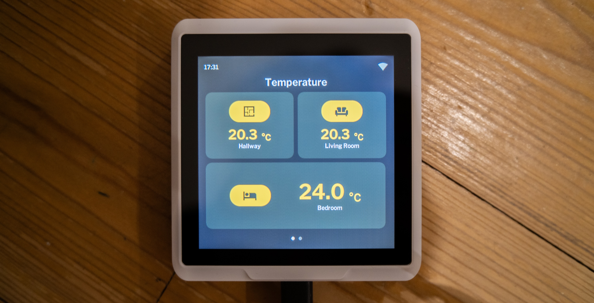
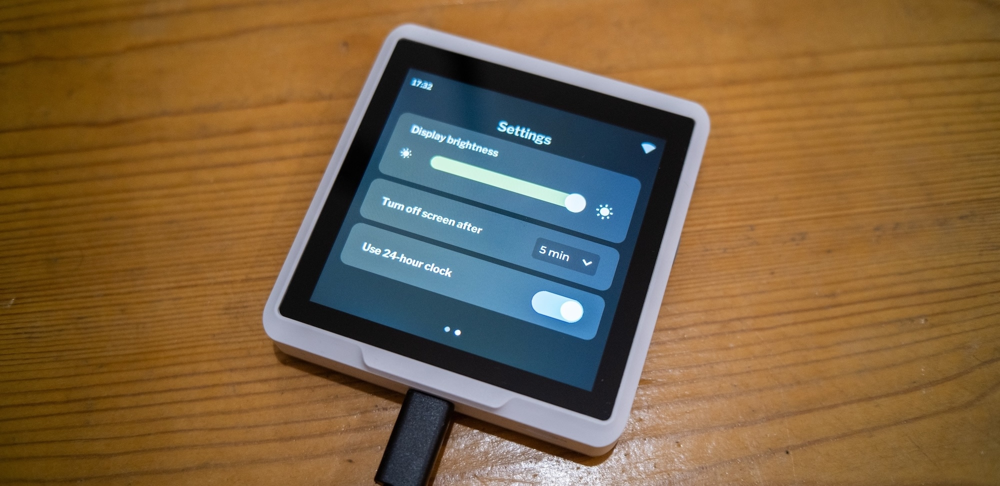

<div align="center">
	
# HomeDicator
###### A customisable SenseCap Indicator Firmware using ESPHome. Design inspired by the [official example project](https://github.com/Seeed-Solution/SenseCAP_Indicator_ESP32/tree/main/examples/indicator_ha). 
	
</div>




## Features
- Supports multiple pages
- Each page can have multiple tiles (4 visible at the same time - more with scrolling)
	-	Currently supported tiles are:
		- Sensor tiles (square & wide)
		- Thermostat tiles (square & wide)
		- More will be added in the future
- Settings page to configure screen timeout, 24h clock and screen brightness

## Planed
- Additional tiles including:
	- Light brightness tiles
	- Switch tiles
	- Button tiles
- Thermostat view (that can be linked to a tile showing the current temperature and opens on click)



## Configuration
Copy both the `sensecap-indicator.yaml` and the `sensecap-indicator` folder into your esphome config folder.  
You can have multiple `sensecap-indicator.yaml` with different names for different devices.  
The folder must retain its name and does not need to be duplicated for each device. 

Open the `sensecap-indicator.yaml` and get conformable with its settings.  

### Sensors
Tiles require sensors to be added to import the state of entities from Home Assistant into ESPHome.  
There are different sensor templates for different kind of Home Assistant entities.

#### Number sensor ("sensor." domain)
Below the sensor block, add the following configuration for each number sensor you wish to add:
```yaml
- !include 
    file: sensecap-indicator/core/templates/sensor.yaml
    vars:
      hass_sensor_id: "airgradient_schlafzimmer_temperature"
```

> [!NOTE]
> `hass_sensor_id`: This is the entity ID of your sensor in Home Assistant. Omit the "sensor." portion you find within Home Assistant.  

#### Climate sensor ("climate." domain)
Below the sensor block, add the following configuration for each thermostat you wish to add.  
It will be used to fetch the currently set temperature.
```yaml
- !include 
    file: sensecap-indicator/core/templates/climate_sensor.yaml
    vars:
      hass_climate_id: "schlafzimmer_schreibtisch" # Omit the "climate." portion you find within Home Assistant
```

> [!NOTE]
> `hass_climate_id`: This is the entity ID of your climate entity in Home Assistant. Omit the "climate." portion you find within Home Assistant.  


### Pages
Once you have added your sensors, go to the **ADD / ADJUST YOUR PAGES HERE** section.  

A page looks like this:
```yaml
- id: first_page
  bg_color: 0x1b1b1b # PAGE BACKGROUND COLOR
  bg_opa: COVER
  widgets:
    - !include
        file: sensecap-indicator/user_interface/templates/page_title.yaml
        vars:
          title: "Bedroom" # CHANGE PAGE TITLE HERE
    - obj:
        styles: content_container
        layout: 
          type: FLEX
          flex_flow: ROW_WRAP
          flex_align_main: LV_FLEX_ALIGN_START
          flex_align_cross: CENTER
          widgets:
            # Your tiles go here!
```
You can use this block if you want to add more pages. Make sure that the id is unique and that you update the title.  
When you have finished adding pages, update the `total_pages` variable at the top of the file to reflect your total pages + the settings page.  

### Tiles
Like sensors there are different templates for different tiles you can add to a page.  
A screen can hold four square tiles at a time, but you can add more and access them by scrolling down on the Indicator.  

#### Sensor tile
To show a numeric sensor value add the following block below `widgets:`.  
```yaml
- !include
    file: sensecap-indicator/user_interface/templates/tiles/sensor/square.yaml
    vars:
      color: 0xeebf41
      hass_sensor_id: "airgradient_schlafzimmer_temperature"
      icon: "\U000F02E3"
      unit: "°C"
      title: "Bedroom"
```	

> [!TIP]
> You can change `square.yaml` to `wide.yaml` for a tile version that is wide instead of square.  

> [!NOTE]
> `color`: The color that will be used for the icon and value label.
> `hass_sensor_id`: Must be the same as within the sensor config block.  
> `icon`: Unicode codepoint of the icon you want to use. See [here](https://github.com/paviro/HomeDicator/blob/main/ESPHome/sensecap-indicator/core/config/fonts.yaml) for icons that are available.  
> `unit`: Unit of the sensor.  
> `title`: Title shown below the sensor value.

#### Thermostat tile
To control a heating thermostat add the following block below `widgets:`.  
```yaml
- !include
    file: sensecap-indicator/user_interface/templates/tiles/thermostat/square.yaml
    vars:
      color: 0xeebf41
      hass_climate_id: "schlafzimmer_schreibtisch"
      min_value: 5
      max_value: 25
      title: "Living Room"
```

> [!NOTE]
> `color`: The color that will be used for the control gauge and temperature label.  
> `hass_climate_id`: Must be the same as within the sensor config block.  
> `icon` (wide versions only): Unicode codepoint of the icon you want to use. See [here](https://github.com/paviro/HomeDicator/blob/main/ESPHome/sensecap-indicator/core/config/fonts.yaml) for icons that are available.  
> `title` (square version only): Title shown below the sensor value.   
> `min_value`: The minimum value that is possible to set.   
> `max_value`: The maximum value that is possible to set.   

> [!TIP]
> You can also change `square.yaml` to `wide.yaml` or `wide_half_height.yaml` for a wide and half-height wide version of the tile.

> [!WARNING]  
> Using `wide.yaml` or `wide-half-height.yaml` requires using the sensor `climate_sensor_wide.yaml` instead of `climate_sensor.yaml`!


### Final notes
You can now compile your firmware and install it on your device.  
Make sure to add your device to Home Assistant (it should be discovered automatically) as it will not receive data if you don't.  
> [!WARNING]  
> If you use tiles that control devices within Home Assistant, you will need to grant permissions for your HomeDicator, see [here](https://esphome.io/components/api.html#api-actions).

> [!CAUTION]
> I build this in my spare time as a hobby.  
> In general, I make no guarantees that it will work forever, even though I intend to keep maintaining it, but sometimes other things are more important.  
> **I also give no guarantees that updates here will not break existing configurations and require a new configuration - especially now in the early stages this will definitely happen!**